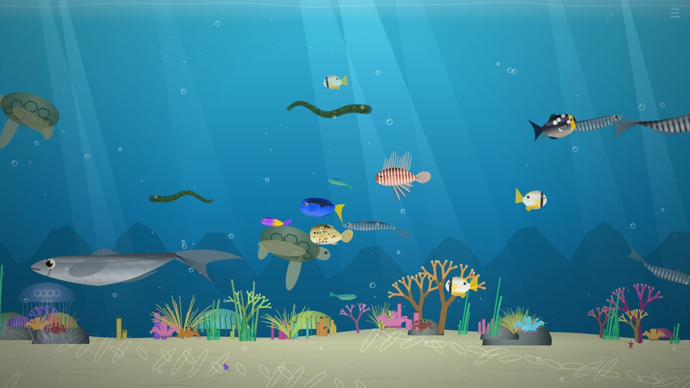
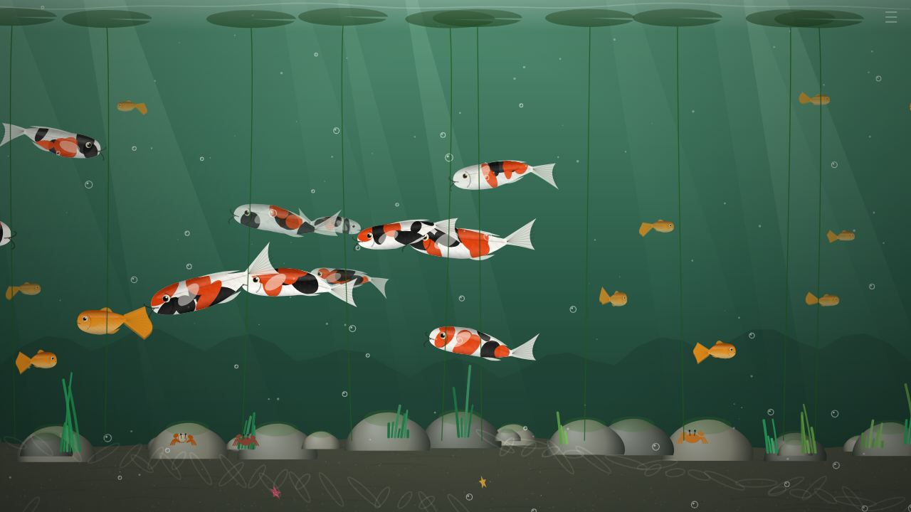
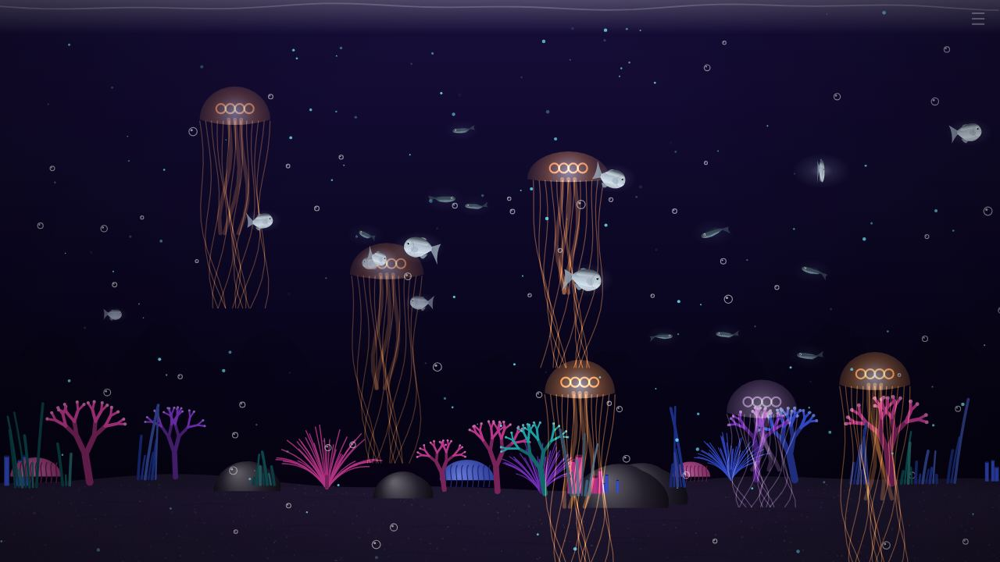
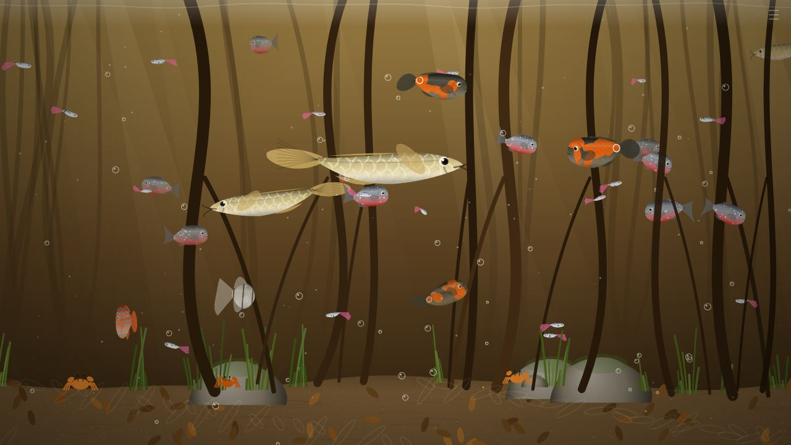

<div align="center">

# 🐟 Kitty Aquarium 🐾

### An endless, self-running aquarium for cats that watch fish.

**44 species · 12 scenes · surprise events · fish your cat can actually "catch"**

[](https://joewolly.github.io/aquarium/)




</div>

---

## ✨ Why it's better than a fish video

A YouTube video loops. Kitty Aquarium never repeats and it **reacts to your cat**:

| | |
|---|---|
| 🐾 **Paw play** | Every tap scatters nearby fish. Tap right on a fish and your cat "catches" it, with sparkles. |
| 🍤 **Feeding** | Hold a finger on the screen and food drifts down. Fish race over to eat it. |
| 🎉 **Surprise events** | Every 1–2.5 minutes: a sardine storm, a jellyfish bloom, a whale in the distance, a shark or manta passing by, a curious fish swimming right up to the glass, or a bubble curtain. |
| 🔄 **Always changing** | Scenes change on their own, and fish come and go, so something new is always arriving. |
| 📖 **Fishdex** | Keeps count of paw taps, catches and how many of the 44 species have shown up so far. |
| 🌙 **Real time of day** | Optional. The tank dims in the evening and at night to match the clock. |
| 🔊 **Water sounds** | Optional soft underwater sound, with a little *bloop* whenever a fish eats. |
| 💡 **Stays on** | Keeps the screen from going to sleep while the aquarium is open. |

---

## 🌊 Twelve scenes

<table>
<tr>
<td width="50%"><br><b>Koi Pond</b>: koi and goldfish under lily pads</td>
<td width="50%"><br><b>Bioluminescent Night</b>: glowing jellies and plankton</td>
</tr>
<tr>
<td width="50%"><br><b>Amazon River</b>: piranhas, arowanas and discus among roots</td>
<td width="50%"><br><b>Tropical Reef</b>: coral, tangs, a manta ray and a moray eel</td>
</tr>
</table>

🪸 Tropical Reef · 🌅 Sunset Reef · 🏝️ Shallow Lagoon · 🌿 Kelp Forest · ⚓ Sunken Ship · 🌑 Deep Ocean · ✨ Bioluminescent Night · 🌋 Volcanic Vents · 🪷 Freshwater Pond · 🎏 Koi Pond · 🌳 Amazon River · 🧊 Arctic Waters

Each scene has its own water, light, plants and scenery, and only the fish that belong there. When the scene changes, the water turns murky and clears again on the new one.

---

## 🐠 Forty-four species

<details>
<summary><b>See them all</b></summary>

**Reef:** Clownfish, Blue Tang, Yellow Tang, Moorish Idol, Butterflyfish, Mandarin, Lionfish, Pufferfish *(puffs up when scared!)*, Parrotfish, Royal Gramma, Regal Angelfish, Wrasse, Triggerfish, Grouper, Barracuda, Reef Shark, Sardine *(swims in schools)*

**Kelp & cold water:** Garibaldi, Rockfish, Cod, Arctic Char

**Freshwater:** Goldfish, Koi, Betta *(several colours)*, Neon Tetra, Guppy, Angelfish, Discus, Oscar, Piranha, Arowana, Cory Catfish, Pleco

**Deep sea:** Anglerfish *(with a glowing lure)*, Lanternfish, Hatchetfish

**Other creatures:** Moon Jelly, Sea Nettle, Seahorse, Sea Turtle, Manta Ray, Moray Eel, plus crabs and hermit crabs walking on the sand

</details>

Every fish is drawn in layers: a curved body that bends as it swims, shading, fine scales, a light sheen, see-through fins and eyes with a highlight. Fish turn around smoothly, and farther fish look smaller and hazier.

---

## 🐱 Setting it up for your cat

1. On a tablet or laptop, open **[joewolly.github.io/aquarium](https://joewolly.github.io/aquarium/)**.
2. Tap the faint **☰** in the top-right corner, then tap **Fullscreen**.
3. Tap **☰** again to hide the menu. Everything else runs on its own.

> 💡 **Tips:** Lay the tablet flat or put the screen at your cat's eye level. Keep it plugged in. Trim your cat's claws, or use a screen protector!

### Controls

| Action | What it does |
|---|---|
| **Tap** | Paw: fish scatter, and tapping right on a fish catches it |
| **Hold** | Drops food |
| **☰** or **M** | Opens or closes the menu |
| **N** | Next scene |
| **E** | Starts a surprise event now |

In the menu you can pick a scene or leave it on **Auto**, and set how long each scene lasts (2, 5 or 15 minutes). You can also change how many fish there are and how fast they swim, and turn the events, time of day, sound and scene-name pop-ups on or off.

---

## 🧊 There's also a 3D version

**[joewolly.github.io/aquarium/3d.html](https://joewolly.github.io/aquarium/3d.html)** is a real-time 3D tank made with [Three.js](https://threejs.org/). Its fish and scenes are invented at random, and it adds depth-of-field blur, soft glow and moving light patterns on the sand. It also has a **barramundi scanned from a real fish**.

It uses more of the device's power than the 2D version. If it runs choppy, turn off **Cinematic effects** in its menu.

### Adding more scanned fish to the 3D tank

Put any `.glb` fish model in `models/` and add a line for it to `models/manifest.json`:

```json
{"file":"clownfish.glb","name":"Clownfish","size":[0.8,1.2],"school":0.2,"flip":false,"credit":"Author, license"}
```

The model is resized and turned to face the right way automatically, and it swims with a body wave. Set `"flip": true` if it swims backwards.

---

## 🛠️ Running it yourself

There's nothing to install or build. It's plain HTML and JavaScript.

```bash
git clone https://github.com/joewolly/aquarium.git
cd aquarium
python3 -m http.server 8000   # then open http://localhost:8000
```

> The 2D version (`index.html`) even works if you just double-click the file. The 3D version has to be served from a web server like the one above, because browsers block the files it loads when a page is opened straight from disk.

### What's where

```
index.html            ← the 2D aquarium (main page), all in one file
3d.html               ← the 3D aquarium
classic.html          ← redirect for old links
models/               ← scanned 3D fish + manifest.json
vendor/               ← Three.js r160 + add-ons, included so no CDN is needed
docs/screenshots/     ← images for this README
```

---

## 🙏 Credits

- **Barramundi fish model:** Microsoft, from the [Khronos glTF Sample Assets](https://github.com/KhronosGroup/glTF-Sample-Assets/tree/main/Models/BarramundiFish), [CC0 1.0](https://creativecommons.org/publicdomain/zero/1.0/)
- **[Three.js](https://threejs.org/)** (MIT) powers the 3D version.
- Every 2D fish, plant and scene is drawn in code, with no image files.

<div align="center">

---

*Made for one very dedicated fish-watcher.* 🐈‍⬛🐟

</div>
